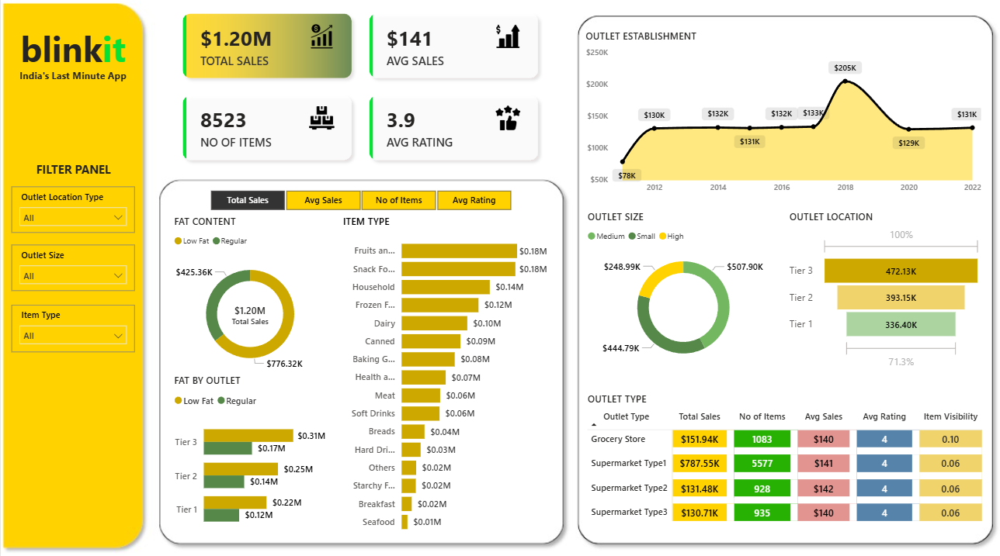

# 📊 Blinkit Sales Analytics Dashboard

A comprehensive **Power BI data analytics project** that provides insights into **sales performance, outlet distribution, customer ratings, and product behavior** for Blinkit — India’s Last Minute App.

---

## 📁 Project Overview
This dashboard visualizes key business metrics to help stakeholders understand:
- Total sales contribution by **fat content, item type, and outlet parameters**
- **Outlet establishment trends** (2011–2022)
- **Outlet size performance**
- **Sales contribution by grocery and supermarket categories**
- Customer behavior through **item count and average ratings**

The goal is to simplify decision-making through a clean, interactive reporting experience.

---

## 🖼️ Dashboard Preview

---

## 🎯 Key Features

### **1. KPI Summary Cards**
- **Total Sales:** $1.20M  
- **Average Sales:** $141  
- **Number of Items:** 8523  
- **Average Rating:** 3.9  

---

### **2. Interactive Filter Panel**
Users can filter the dashboard based on:
- Outlet Location Type  
- Outlet Size  
- Item Type  

This improves data exploration and allows focused insights.

---

### **3. Sales Analysis**

#### **Fat Content Breakdown**
- **Low Fat:** $425.36K  
- **Regular:** $776.32K  

#### **Item Type Contribution**
Top-performing categories:
- Fruits & Vegetables – $0.18M  
- Snack Foods – $0.18M  
- Household Items – $0.14M  
- Frozen Foods – $0.12M  

---

### **4. Outlet Performance**

#### **Outlet Establishment Trend (2011–2022)**
A line-area chart that displays year-wise sales, highlighting a peak around 2018.

#### **Outlet Size Sales**
- Small: $507.90K  
- Medium: $248.99K  
- Large: $444.79K  

#### **Outlet Location Contribution**
- Tier 3: $472.13K  
- Tier 2: $393.15K  
- Tier 1: $336.40K  

---

### **5. Outlet Type Comparison Table**

| Outlet Type            | Total Sales | No. of Items | Avg Sales | Avg Rating | Item Visibility |
|------------------------|-------------|--------------|-----------|------------|-----------------|
| Grocery Store          | $151.94K    | 1083         | $140      | 4          | 0.10            |
| Supermarket Type 1     | $787.55K    | 5577         | $141      | 4          | 0.06            |
| Supermarket Type 2     | $131.48K    | 928          | $142      | 4          | 0.06            |
| Supermarket Type 3     | $130.71K    | 935          | $140      | 4          | 0.06            |

---

## 🛠️ Tools & Technologies Used
- **Power BI Desktop** – dashboard creation  
- **Power Query** – data cleaning & transformation  
- **DAX** – calculated fields & KPIs  
- **Retail dataset (Blinkit format)** – data source  

---

## 📌 Project Objectives
- Identify sales trends across product types and outlet characteristics  
- Compare outlet performance based on size and location  
- Understand customer preferences using ratings and item counts  
- Support informed decision-making for business stakeholders  

---

## 🚀 How to Use This Report
1. Download the `.pbix` file from this repository.  
2. Open it using **Power BI Desktop**.  
3. Use the filter panel to explore data interactively.  
4. Hover over visuals for detailed insights.  

---

## 📣 Key Insights Summary
- **Regular items generate over 60% of total sales.**
- **Supermarket Type 1 is the top revenue generator.**
- **Tier 3 outlets outperform Tier 1 and Tier 2 outlets.**
- **Sales peak in 2018, followed by a decline.**
- **Larger outlets show better productivity.**

---

## ⭐ Conclusion
This dashboard provides a 360° analytical view of Blinkit’s retail operations, enabling better planning, improved customer targeting, and stronger business decisions.

---

## 🤝 Connect
For collaborations, dashboard customizations, or project discussions — feel free to reach out!

